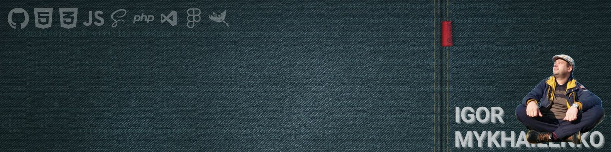

# 

## Hello! 👋 <br> My name is Igor

> I'm starting this journey to become a front-end developer


[](https://github.com/piyushsuthar/github-readme-quotes)

## 📲 Contact whith me

[][linkedin]
[][Facebook]
[][Github]

[][rsschool]

## 😉 About me

<details>
    <summary>A few words about me..</summary>
        <br>
        <p>Successful experience in the business field in management positions for more than 20 years, as well as experience in organizing sales in complex markets with aggressive competition, complex decision-making structures and long transaction terms.<br>
        >> this allows me to freely navigate when solving business problems, easily understand the assigned tasks and interpret them to develop software products.</p>
        <p>Experience in building long-term partnerships. <br>
        >> I understand the way of thinking and the psychology of decision-making of the Partner/Client/Customer. I determine the correct “chain of clients” - decision makers (DMs) and persons influencing decision making (DIP).</p>
        <p>I have a higher technical education with a degree in Software Engineer.
        Additionally, I studied at the STEP Computer Academy.
        As a thesis, I developed an online store of electronic goods and a forum for students. <br>
        In both projects I used: <br>
        FrontEnd - HTML, CSS, JavaScript, PHP; <br>
        BackEnd - HTML, CSS, JavaScript, PHP, MySQL <br>
        I defended my thesis with “excellent” marks.</p>
        <p>I have skills in Internet development, FrontEnd, BackEnd, FullStack. HTML, CSS, JS.
        I work with BPM, Figma, Git. And also, Adobe Photoshop, Adobe Muse, Canva, Tilda, MS PowerPoint presentations, Google tools and others.</p>        
        <p>I have experience in building automation, smart home, based on Crestron processors, I was trained and received a certificate as a control interface programmer.
        The interface was programmed using a stripped-down C language and a visual designer. This solution is very similar to VS WPF or another IDE.</p>
        <p>I have a fairly flexible logical thinking, which allows me to be ready to master all the stacks and frameworks necessary for work in a short time.</p>
        <p>IT project management experience:<br>
        - implementation of CRM systems,<br>
        - development of company websites,<br>
        - landing pages with selling features.</p>        
        <p>Hired and supervised the work of third-party performers, designers, and programmers.
        I am proficient in prototyping tools.
        I know the methodology Agile, Scrum, Kanban, Waterfall.</p>
        <p>Experience in managing complex projects. I competently formulate the structure of tasks, using basic and specialized tools that allow me to quickly and clearly control each phase of the project.
        I am able to effectively organize and plan the work process.</p>
        <p>Organization of a sales department from “0”. Experience in bringing new products to market. Development of road maps. Successful experience in creating a small business from “0”. Organization of subsidiaries, branches, and representative offices abroad.</p>
        <p>I am able to set the right tasks in accordance with the goals and mission of the company, monitor their implementation and achieve effective results. I understand and can apply in practice the principles of functioning of manufacturing enterprises and companies in the service sector. Experience in construction project management. Reading working drawings.</p>
        <p>November 2021 – January 2022 – expert at the NRNU MEPhI Engineer Competition.
        Objectives - Professional assessment of diploma qualification works in the field of science, business and industry.</p>
        <p>I'm not afraid of work, I immerse myself in the process. <br>
        Ready for business trips.<br>
        Always ready to improve the level of professionalism and acquire new knowledge and skills.</p>
</details>

### 🔊 Languages

    - English - A2, reading technical literature, communication
    - Czech - B1, currently studying
    - Russian- freely
    - Ukrainian- freely


## 📔 Code example

```js
const MIU = {
    name: 'Igor',
    age: 'always 17',
    version: '2.0.1',

    health: '100%',
    energy: '100%',
    vision: '100%',
    
    language: ['english', 'čeština'],
    skills: ['html/css', 'js', 'sass/scss'],
    frameworks: ['bootstrap', 'tailwind', 'vue.js', 'react'],

    action: "go to -> ",

    learnLanguages(language) {
        MIU.language += language;
    },

    addSkills(skill) {
        MIU.skills += skill;
    },

    doIt(runAction) {
        MIU.action += runAction;
    }
}

let newFramework = ' + Laravel';
let runAction = 'coooding...';

MIU.addSkills(newFramework);
MIU.doIt(runAction);
```


## 🧑‍🎓 EDUCATION

<details>
    <summary>🏦 High school</summary>
    <br>
        <table>
        <tr>
            <td>
                VSB - Technical University of Ostrava <br>
                Faculty of Electrical Engineering and
                Computer Science
            </td>
            <td>
                Master of Computer Science
                Sep. 2023 - July 2026
            </td>
        </tr>
        <tr>
            <td>
                National Mining University <br>
                Faculty of Computer Systems
                Software
            </td>
            <td>
                Software Engineer
                2005 <br>
                Bachelor. Junior engineer
                2004
            </td>
        </tr>
        <tr>
            <td>
                RANEPA <br>
                Project management
            </td>
            <td>
                Business analyst
                2022
            </td>
        </tr>
        <tr>
            <td>
                State University of Management <br>
                Faculty of Entrepreneurship in the
                Social Sphere
            </td>
            <td>
                Event-management. <br>
                Fundraising as part of management
                2008
            </td>
        </tr>
        <tr>
            <td>
                National Mining University <br>
                Faculty of Economics
            </td>
            <td>
                Bachelor of Foreign Trade
                Management
                2006
            </td>
        </tr>
        <tr>
            <td>
                ANO DPO "City Business School" <br>
                MBA General
            </td>
            <td>
                Master of Business Administration <br>
                - not finished
            </td>
        </tr>
        </table>
</details>

<details>
    <summary>🏫 Courses and trainings</summary>
    <br>
        <ul>
            <li>RS School EPAM - JS/Front-end</li>
            <li>IT STEP - Computer graphics and Internet technologies</li>
            <li>Yandex - Project Manager</li>
            <li>Stepik - Project Manager</li>
            <li>Stepik -PHP, MySQL - basics</li>
            <li>Stepik- WEB Technology. FE</li>
            <li>Nettology - Front-end/JS</li>
            <li>Stepik -C# - Basics</li>
            <li>CBS - Management skills. Effective Solutions</li>
            <li>CBS - Time management. Delegation of powers</li>
            <li>CBS - Effective communications. media technologies. GR</li>
            <li>CBS - Social Psychology and Behavioral Analysis</li>
            <li>CBS - Stress management. Conflict Management</li>
            <li>CBS - Business Etiquette. Business meeting</li>
        </ul>
</details>

## 💼 WORK EXPERIENCE

<details>
    <summary>more then 20 years of management & bizdev experience</summary>
    <br>
    <ul>
    <li>BDO - MILITON
    2022 <br>
    Construction. Engineering technology.
    Projection, production, sale and installation of water supply, sewage, heating, ventilation and air conditioning systems, high current and low current systems
    </li>
    <li>CBDO - LPK 
    2020 - 2022<br>
    Production of house kits using the Massive Holz Mauer technology, Glued laminated timber, molded wood products, additionally - sale of woodworking waste
    </li>
    <li>CBDO - EBR-Group 
    2019 - 2020<br>
    Organization of congress and exhibition events.
    Rental of exhibition space, organization of events, design, engineering and construction of exhibition space, catering
    </li>
    <li>CBDO - TEHPROM 
    2018 - 2019<br>
    Production, sale and maintenance of cash registers
    </li>
    <li>CBDO - SPETSTORGSNAB
    2008 - 2018 <br>
    Construction. Engineering equipment
    Design, manufacture, sale and installation of water supply systems, sewerage, heating, ventilation and air conditioning, power supply and low-voltage systems, Smart-Home
    </li>
    <li>Project Manager - TECHNOENGINEERING 
    2006 - 2008 <br>
    Control systems. Audio, video, conference calls
    Design, wholesale and integration of a/c signal switching systems, smart home control systems, production process control systems
    </li>
    <li>Sales Manager - Pridneprovsky Metallurgical Alliance 
    2004 - 2006 <br>
    Ferrous and non-ferrous metal rolling
    Collection, sorting and processing of ferrous and non-ferrous scrap metal
    </li>
    <li>Sales Manager - NEFTEK 
    2003 - 2004 <br>
    Wholesale of light petroleum products - gasoline grade 92/95, diesel fuel
    </li>
    </ul>
</details>

## 📊 Some stats


<!-- --- --- --- -->
<!-- ### links -->
[github]: https://github.com/MIU-cz
[linkedin]: https://www.linkedin.com/in/miu-cz
[Facebook]: https://www.facebook.com/mehaligor.cz
[rsschool]: https://app.rs.school/profile?githubId=miu-cz
